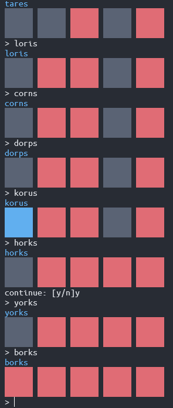

# a certain game solver
 

# Usage
```node
npm run build
npm run start

# dev
ts-node src/{filename}.ts
npm run dev:watch
```

# License
Distributed under the [MIT license](https://opensource.org/licenses/MIT).
