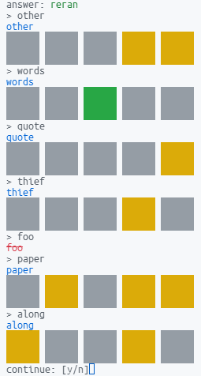

# a certain game solver
 

# Usage
```node
npm run build
npm run start
```

# License
Distributed under the [MIT license](https://opensource.org/licenses/MIT).

The list of words comes from https://www-cs-faculty.stanford.edu/~knuth/sgb.html, which is public-domain sources.